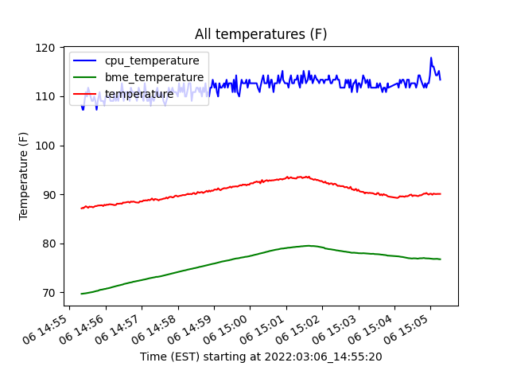

# weatherBalloon
Raspberry Pi project for a High Altitude Weather Balloon

## Introduction

Raspberry Pi project for a High Altitude Weather Balloon.  This code performs the following:
   * records several enviornmental factors including temperature, humidity and pressure
   * records GPS location
   * records orientation (pitch, yaw, roll)
   * records video annotated with some of the above values

## Installation

Create a python 3 virtualenv with the required packages ...

TBF: include requirements.txt

## Usage

   * source the virtualenv
   * adjust values in weatherBalloon.conf (including length of video, etc.)
   * python weatherBalloon.py

## Retrieving the Data

The sensor values are recorded in a CSV file marked 'env.[timestamp].csv'.  These values can then be parsed by the plotEnvCsv function.

TBF: enable the plotEnvCsv function from the command line.

## Data Examples

