# weatherBalloon
Raspberry Pi project for a High Altitude Weather Balloon

## Introduction

Raspberry Pi project for a High Altitude Weather Balloon.  It essentially has two halves: data acquisition and data anlaysis.  The data acquisition code performs the following:
   * records several enviornmental factors including temperature, humidity and pressure
   * records GPS location
   * records orientation (pitch, yaw, roll)
   * records video annotated with some of the above values

## Installation

For running the analysis code on a desktop:

Create a python 3 virtualenv with the required packages in requirements.txt

TBF: include more instructions for installation on the Raspberry Pi for running data acquisition.

## Usage

   * source the virtualenv (may not be needed on Raspberry Pi)
   * adjust values in weatherBalloon.conf (including length of video, etc.)
   * python weatherBalloon.py # for running data aquisition
   * python weatherBalloon.py [path to csv file] # for plotting results

## The Rasperry Pi

Here is our assembled Raspberry Pi, with attached:
   * Camera module
   * SenseHat with LCD, joystick, accelerometer, temperature, pressure, and humidity sensors
   * BME temperature, pressure and humidity sensor
   * GPM module and antenna

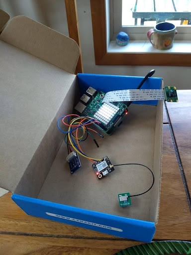

Here is the Raspberry Pi in it's 3D printed enclosure for the weather balloon launch.

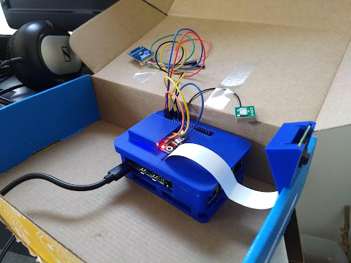

Here's an informal wiring diagram:

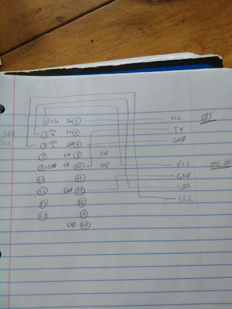

## Assembly Instructions

### Installing the OS (Raspian)

https://www.raspberrypi.com/software/

We used the Raspberry Pi Imager on Mac to write the Raspberry Pi OS (32-bit) to our card.  Insert that into the Pi, boot up and follow some of the setup instructions and you'll be on your way.

### Installing the necessary software

This repository is written in Python 3, so to avoid problems, instead of following the general 
instructions below, I used a Python 3 virtual environment, and installed the required packages via
'pip install -r requirements'.

More details below.

### Camera

   * https://projects.raspberrypi.org/en/projects/getting-started-with-picamera/
   
### Sense Hat

Installing the Sense Hat and using it with Python is straight forward:

   * https://www.raspberrypi.com/documentation/accessories/sense-hat.html
   * https://pythonhosted.org/sense-hat/
   
However, I had problems with Python 3 not finding the RTIMU library.  Follow these instructions:

   * https://github.com/astro-pi/python-sense-hat/issues/58#issuecomment-255783155
   
### BME 280 Sensor

   * https://pypi.org/project/RPi.bme280/
   * https://www.raspberrypi-spy.co.uk/2016/07/using-bme280-i2c-temperature-pressure-sensor-in-python/
   
### GPS Module

   * https://sparklers-the-makers.github.io/blog/robotics/use-neo-6m-module-with-raspberry-pi/

### Static IP Address

Rather then having to plug in the monitor, keyboard, etc. into the Pi, it's easier to enable SSH in the Pi configuration, set a static IP address for you Pi, and then just ssh into the Pi from another computer.  Lots of ways to create the static IP address, I used the advice here:

https://pimylifeup.com/raspberry-pi-static-ip-address/

### VNC

Getting into the Pi via ssh in a terminal is useful, but you don't get a desktop.  Again, lots of ways to do this, but I found VNC to be helpful:

https://raspberrypi-guide.github.io/networking/connecting-via-VNC

### Starting up weather balloon software on Pi startup

Because we'll be launching the Pi with the balloon at a site possibly without being able to interface with the Pi (no wifi, no monitor, etc.), we want the weather balloon software to start up as soon as the Pi powers up.  Again, lots of ways to do this, but I used the rc.local file as described here:

https://www.dexterindustries.com/howto/run-a-program-on-your-raspberry-pi-at-startup/

https://learn.sparkfun.com/tutorials/how-to-run-a-raspberry-pi-program-on-startup/all

Note when we start up, we need to a) source the correct virtual environment b) collect any output in case we need to debug issues.  To do this, we are calling the runWeatherBalloon bash script.

## Retrieving the Data

The sensor values are recorded in a CSV file marked 'env.[timestamp].csv'.  These values can then be parsed by the plotEnvCsv function.  To see the types of output, see the Results section.

## Results

### March 6 2020 Test Run

Weather Balloon software was run for 10 minutes while taking a short drive.  All sensors and video seemed to work correctly.

Here is a screen shot from the annotated video:

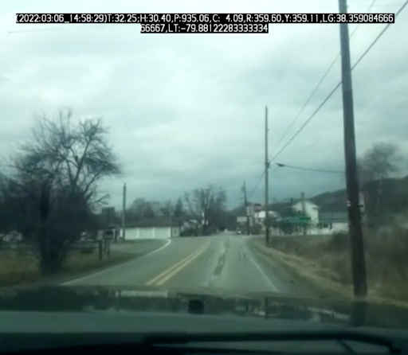

Here the pressures from the two sensors make sense, since we first dropped 300 feet in altitude, and then backtracked back up again.

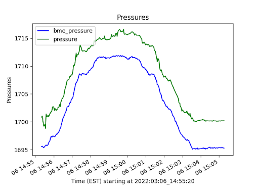

Here the temperatures from our three sensors are presented.  The SenseHat temperature sensor is right above the CPU, so this shows how it is heated, unlike the BME sensor.

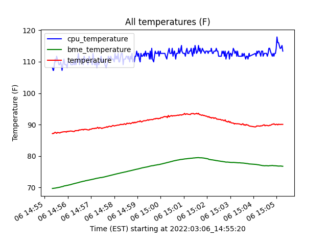

### May 18 2020 Balloon Launch

Our launch and recovery of the balloon and the payload, including the Raspberry Pi, was succesfull!  There are too many detail to include here, but here's the highlights:

Here's how the Raspberry Pi was mounted in the payload:

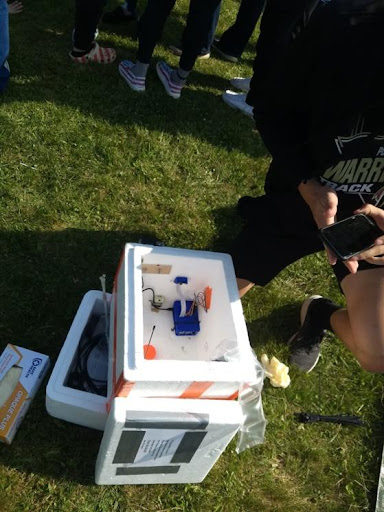

And the actual launch of the balloon:

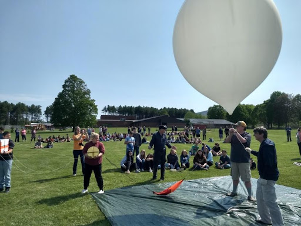

Once we recovered the payload, we were able to extract the video and plot the results.  Here's a screen shot of part of the annotated video:

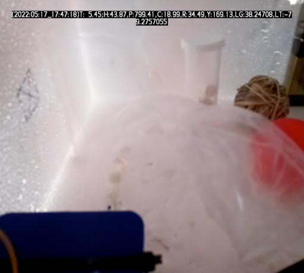

And finally, some of our very interesting results!  Here we track our balloons 2 hour flight over a map of the area:

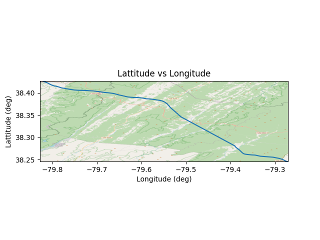

This is a plot of the pressure inside and outside the payload, in units of hPa.  It makes sense that they are very close, since the holes in the payload container would cause the air pressure to equalize.  The constant air pressure at first makes sense since we started taking data for about 45 minutes before we launched.  Then the pressure decreases, which makes sense, since the balloon was increasing in altitude.  From the pressures, it looks like it ascended for about 35 minutes (till about 11:00 AM), then descended about the same distance in only 10 minutes (about 11:10 AM).  It looks like we stopped taking data when it finished it’s decent, rather than continuing for the full configured 4 hours.  This is probably due to the crash landing where the power supply may have been interrupted.  

Also, these pressures show that we perhaps reached an altitude of 46,000 feet!

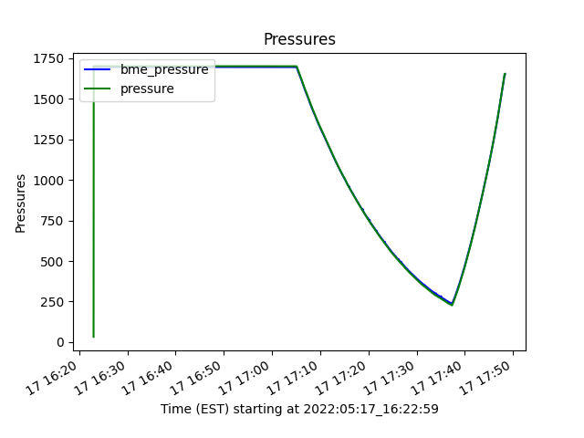

The plots of the temperatures tell a similar story.  Here the difference is that the temperatures measured inside the payload are quite different from the external sensor readings.  This makes sense, since the small holes in the payload probably allow enough air flow for the pressure to equalize, but not the temperature.

Some interesting things happening here.  First of all, concerns about keeping the electronics warm were unfounded – indeed it’s good they didn’t overheat.  The extreme cold encountered at the top of the balloon’s flight is remarkable (~ -60 F!).  Also of interest is the cooling of the inside of the payload near the end.  This may have been from the rapid decent, causing cool air to rush through the holes, cooling the box down?

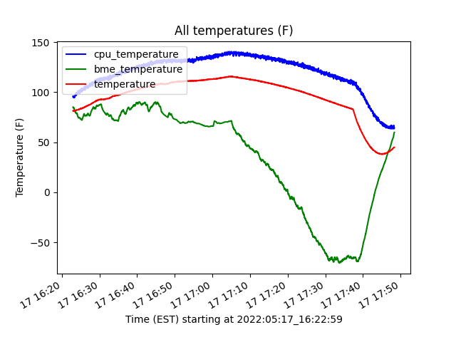

We also were using external cameras on the payload but are not including those here, since they were not taken using this software.

Finally, the actual data from the May 18 launch is included here at images/may18launch/env.2022_05_17_16_22_55.csv
